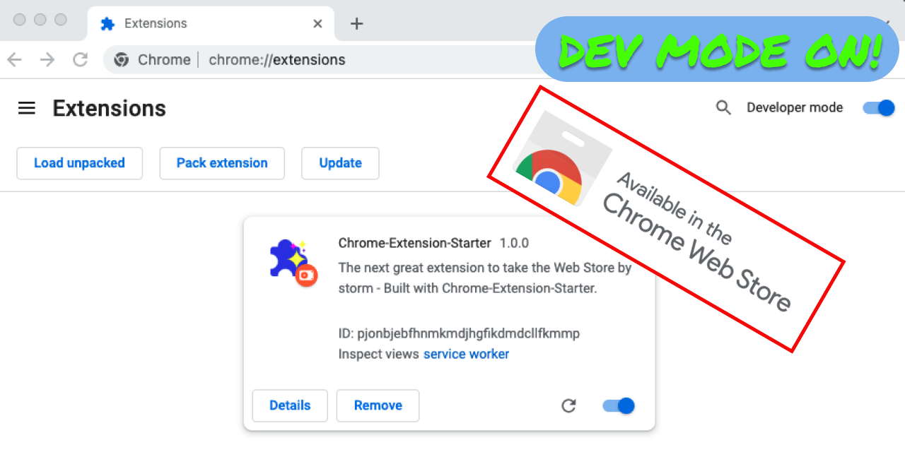

# Chrome-Extension-Starter

[Chrome-Extension-Starter](https://github.com/albertpatterson/chrome-extension-starter) is a starter project for a [Chrome Browser Extension](https://developer.chrome.com/docs/extensions/) including a framework and build system.

  

It facilitates rapid development and creation of optimized assets for deployment - ideal for developing complex extensions. This project also offers file watching and automatic reloading to narrow development cycles. It utilized many familiar tools for web development (Webpack, Gulp, Babel, Typescript etc) to create unpacked assets for local development as well as a zip file for deployment to the web store.

## Usage

Create extension resources automatically via npx

`npx create-extension [new directory name]`

- options
  - -j or --javascript=true to use javascript instead of typescript
  - -i or --install=true to automatically install
  - -y or --yes=true to accept defaults (create in a 'browser_extension" directory with typscript and automatically install)

## Development

Once the extension resources are created, the following scripts are available

- build the project (prod mode): `npm run build`
- build the project (dev mode): `npm run build-dev`
- build the project in dev mode, watch for changes and automatically rebuild and reload the extension. `npm run watch`
  - Note that the extension should be loaded AFTER running this command for automatic reloading to work correctly.
- Typical first steps include
  - Update the package.json and src/manifest.json with the details for your project and configuration for your extension.
  - update the files under src to build your application

## License

This project is licensed under the MIT License - see the [LICENSE.md](LICENSE) file for details
